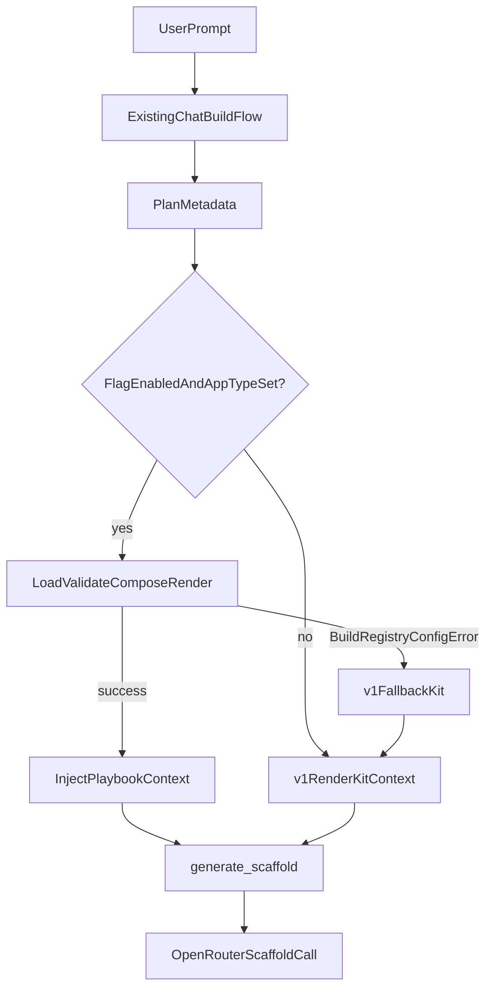

# ADR-0017: Opt-in Build Registry v2 Scaffold Wiring

## Status

**Proposed**

This ADR authorizes **design only** for Phase 2 scaffold wiring. No runtime, chat, API, or default-behavior change is authorized until follow-up implementation PRs (Phase 2B+) explicitly reference this ADR and land behind a disabled-by-default feature flag.

Related:

- [ADR-0016: Generative Build Kit Registry v2](0016-generative-build-kit-registry-v2.md) — target architecture
- [ADR-0011: LLM scaffold staged by template kind](0011-llm-scaffold-staged-by-template-kind.md) — current scaffold path

---

## Context

HAM Lane A (workspace chat → scaffold → source snapshot → Workbench preview) already uses **generative** Builder Kit metadata — not checked-in starter templates.

### What exists today (v1)

| Component | Detail |
|-----------|--------|
| Builder Kit JSON | Six app-archetype kits under `src/ham/data/builder_kits/` (`landing-page`, `dashboard`, `todo`, `calculator`, `tetris`, `generic`). |
| Loader | `src/ham/builder_kits.py` loads kits at import time; exposes `get_kit`, `get_kit_for_template_kind`, `render_kit_context`. |
| LLM scaffold | `src/ham/builder_llm_scaffold.py` reads `plan.metadata["template_kind"]`, resolves a kit via `get_kit_for_template_kind()`, and injects v1 context in `_build_scaffold_messages()`. |
| Kit routing | `src/ham/builder_kit_router.py` maps free-form prompts to a kit id via regex (`select_kit_for_prompt`). |
| Chat path | `src/ham/builder_chat_scaffold.py` builds a synthetic `Plan` with `metadata.template_kind = select_kit_for_prompt(user_message)` and calls `generate_scaffold()`. |

v1 kits describe **how to think and build** (stack recipe, design recipe, validation checklist, safety constraints). HAM does **not** clone checked-in starter file trees per kit.

### What exists today (v2 — unwired)

| Component | Detail |
|-----------|--------|
| Schema pilot | `docs/build-kit-registry-v2/game-pack/` — Game Pack pilot (`schema_version: "0.1"`, `registry-pack.yaml`, 17 indexed modules). |
| Package | `src/ham/build_registry/` — lazy loader/composer/renderer (`load_registry_pack`, `validate_registry_pack`, `compose_build_recipe`, `render_playbook_context`). |
| CLI | `scripts/validate_game_pack_registry.py` — read-only validate + optional render sample. |
| Tests | `tests/test_build_registry.py` — 11 cases; happy path, broken-ref/cycle fixtures, no-import wiring guards. |
| CI | `.github/workflows/ci.yml` — warning-only steps for build registry tests + game pack validation (`continue-on-error: true`). |

The Game Pack pilot validates end-to-end: `game.idle-incremental` composes with mechanic order `mechanic.score → mechanic.economy → mechanic.upgrades → mechanic.save-load`; rendered playbook context is ~8,822 characters (under the 12k budget).

### Why Phase 2 must stay opt-in

Phase 1 intentionally left v2 **unwired**:

- No chat/scaffold/API integration
- No runtime behavior change
- No template cloning
- No v1 JSON replacement

Phase 2 must prove that v2 playbook context improves scaffold quality **without** changing default Lane A behavior for all users. v1 Builder Kits remain the default path until explicit metadata and a feature flag enable v2.

---

## Decision

Introduce **opt-in Build Registry v2 scaffold context injection** behind explicit controls. **Both** must be present to attempt the v2 path:

1. **Feature flag:** `HAM_BUILD_REGISTRY_V2_ENABLED=false` (default)
2. **Plan metadata:** `registry_v2_app_type` (e.g. `game.idle-incremental`)

Optional metadata:

| Key | Default | Purpose |
|-----|---------|---------|
| `registry_v2_pack_root` | repo-relative default (see Safety) | Override pack directory for internal tests |
| `template_kind` | existing v1 field | Unchanged; used for v1 fallback when v2 fails |

App-type YAML may declare `legacy_v1_fallback` (pilot: `generic`) — the v1 kit id used when v2 load/validate/compose/render fails.

**Prompt injection (Option B):** When v2 succeeds, inject **only** v2 `render_playbook_context(recipe)` — not v1 `render_kit_context(kit)` in the same message. On any v2 failure, silently fall back to v1 using `legacy_v1_fallback`.

No automatic v2 routing from user prompts in Phase 2. No replacement of `select_kit_for_prompt()`.

---

## Non-goals

Phase 2 explicitly does **not** authorize:

| Non-goal | Rationale |
|----------|-----------|
| Default v2 routing | All users stay on v1 unless flag + metadata opt in |
| User-facing kit picker | Selection stays internal/inferred until product requests it |
| Public kit catalog API | No `GET /api/build-registry/*` routes |
| Builder Studio merge | Lane B profiles stay separate (ADR-0016) |
| v1 JSON replacement | Strangler only; v1 kits remain loadable |
| Template / starter cloning | YAML modules are playbooks, not source trees |
| Validator execution | Validators remain `runner: conceptual` in Phase 2 |
| Recovery execution | Recovery playbooks remain spec-only in Phase 2 |
| Telemetry emission | No learning-hook events wired in Phase 2 |
| Game Pack expansion | No new app types, mechanics, or recipes in Phase 2 |
| Changes to `builder_chat_scaffold.py` | Phase 2C targets `builder_llm_scaffold` only; chat synthetic plan unchanged unless internal harness sets metadata manually |

---

## Proposed future flow



Narrative:

1. User prompt enters the existing chat/build intent flow unchanged.
2. Plan/scaffold metadata **may** include `registry_v2_app_type` (internal/manual in Phase 2D; not from router by default).
3. If `HAM_BUILD_REGISTRY_V2_ENABLED` is true **and** `registry_v2_app_type` is set:
   - Load registry pack from resolved `pack_root`
   - Validate pack
   - Compose recipe for app type
   - Render playbook context
   - Inject into scaffold user message under `Build Registry v2 playbook context:`
4. If any v2 step fails:
   - Log internal warning with reason
   - Fall back to v1 `render_kit_context(kit)` using `legacy_v1_fallback` from app type YAML (or `get_kit_for_template_kind(template_kind)` as secondary)
5. Scaffold continues normally (OpenRouter call, JSON parse, retry policy unchanged).

---

## Candidate integration points

| Module | Role today | Phase 2 ownership |
|--------|------------|-------------------|
| `src/ham/builder_llm_scaffold.py` | `_build_scaffold_messages()`, `generate_scaffold()` — v1 kit lookup + context injection | **Primary hook:** read flag + metadata; invoke v2 helper; apply Option B injection; v1 fallback |
| `src/ham/build_registry/` | Unwired load/validate/compose/render | All v2 I/O; no LLM calls |
| `src/ham/build_registry/scaffold_context.py` (new, Phase 2B) | — | `resolve_scaffold_context(plan) -> ScaffoldContextResult` — encapsulates v2 try + v1 fallback selection |
| `src/ham/builder_kits.py` | v1 kit load + `render_kit_context()` | **Unchanged**; fallback only |
| `src/ham/builder_kit_router.py` | `select_kit_for_prompt()` regex routing | **Unchanged** in Phase 2 |
| `src/ham/builder_chat_scaffold.py` | Synthetic plan + `template_kind` from router | **Out of scope** Phase 2C (unless internal test sets metadata) |
| `src/ham/builder_chat_hooks.py` | Lane A happy-path entry | **No change** Phase 2 |
| `src/ham/builder_planner.py` | Plan generation | **Deferred** — planner-owned metadata is Phase 2E+ |

**Recommendation:** Keep orchestration at the scaffold prompt assembly boundary (`builder_llm_scaffold._build_scaffold_messages` or a helper it calls). This is the single choke point where v1 context is injected today (~L285–288). Matches ADR-0016 strangler guidance: new module owns composition; v1 loader untouched.

### Responsibility split (future)

| Concern | Owner |
|---------|--------|
| Feature flag check | `build_registry/scaffold_context.py` or `builder_llm_scaffold` |
| Metadata read (`registry_v2_app_type`, `registry_v2_pack_root`) | Same |
| v2 recipe composition | `build_registry.compose` |
| Prompt context injection | `builder_llm_scaffold._build_scaffold_messages` |
| Fallback to v1 | `scaffold_context` helper → `builder_kits.render_kit_context` |
| Error handling / logging | `scaffold_context` helper; never fail scaffold pre-LLM for v2 errors |

---

## Prompt injection strategy

| Option | Description | Pros | Cons |
|--------|-------------|------|------|
| **A** | Append v2 playbook context after v1 Builder Kit context | Safest migration; v1 always present | Prompt bloat (~8.8k + v1); conflicting guidance |
| **B** | Use v2 context **instead of** v1 when v2 succeeds | Clean opt-in signal; bounded context | Requires reliable fallback |
| **C** | v2 for planning only, not scaffolding | Smaller blast radius | Does not prove scaffold value |

**Recommendation: Option B** for explicit opt-in flows.

When flag + metadata present and v2 pipeline succeeds:

```text
{existing plan user block}

Build Registry v2 playbook context:
{render_playbook_context(recipe)}
```

Do **not** also include `Builder Kit context:` from v1 in the same message.

When v2 fails or is not opted in, use today's v1 block:

```text
Builder Kit context:
{render_kit_context(kit)}
```

---

## Failure and fallback policy

User-facing impact in Phase 2: **silent fallback** — no new normie error copy for v2 failures. Scaffold proceeds with v1 context.

| Case | Behavior | User-facing impact | Internal log (suggested) | Fallback |
|------|----------|-------------------|------------------------|----------|
| Flag disabled (`HAM_BUILD_REGISTRY_V2_ENABLED` not truthy) | v1 path only | None | — (optional debug) | N/A |
| No `registry_v2_app_type` in metadata | v1 path only | None | debug: `build_registry_v2_skipped_no_metadata` | N/A |
| Unknown app type id | Skip v2 compose | None | warning: `build_registry_v2_unknown_app_type` | `legacy_v1_fallback` kit, else `get_kit_for_template_kind(template_kind)` |
| Pack root missing / unreadable | Skip v2 | None | warning: `build_registry_v2_load_failed` | Same v1 fallback |
| Validation failure | Skip v2 | None | warning: `build_registry_v2_validate_failed` + error summary | Same v1 fallback |
| Compose failure | Skip v2 | None | warning: `build_registry_v2_compose_failed` | Same v1 fallback |
| Render failure or empty render | Skip v2 | None | warning: `build_registry_v2_render_failed` | Same v1 fallback |
| Render budget exceeded | Use truncated v2 (`_apply_render_budget`) if non-empty | None | info: `build_registry_v2_render_truncated` | Fallback only if truncated output empty |
| v2 context OK but LLM scaffold fails | Existing LLM error path (`LLMScaffoldError`, retry) | Existing error UX | existing scaffold logs | No v2-specific change |
| v2 OK, scaffold OK | Normal success | None | info: `build_registry_v2_context_used` with `app_type_id`, `pack_id` | N/A |

Structured log fields (suggested, no telemetry store in Phase 2): `registry_v2_app_type`, `registry_v2_pack_id`, `fallback_reason`, `fallback_kit_id`.

---

## Safety and boundaries

1. **Guidance only.** v2 playbook context instructs the LLM; it does not execute validators, recovery, or generated code from YAML files.
2. **Validators/recovery remain conceptual** in Phase 2 (`runner: conceptual`). No harness or edit-worker integration.
3. **No template cloning.** Registry modules must not be materialized as app source trees or copied into snapshots.
4. **No LLM calls in `build_registry`.** Composition and render are deterministic string assembly.
5. **Lazy loading.** No import-time pack load in `build_registry` or production modules. Pack load only when flag + metadata trigger v2 path.
6. **Lazy import (optional).** When flag disabled, avoid importing `build_registry` if practical (Phase 2B test).
7. **Default pack root** (documented default, not cwd-relative):

   ```text
   docs/build-kit-registry-v2/game-pack
   ```

   Resolve via repo root anchor (e.g. path relative to package or explicit env override `HAM_BUILD_REGISTRY_V2_PACK_ROOT` — open question for implementation).

8. **No API surface.** Phase 2 does not expose registry state to the browser or Builder Studio.

---

## Minimal implementation sketch

Pseudocode only — not implemented by this ADR.

```python
# Phase 2B helper — src/ham/build_registry/scaffold_context.py (proposed)

def build_registry_v2_enabled() -> bool:
    return os.environ.get("HAM_BUILD_REGISTRY_V2_ENABLED", "").strip().lower() in (
        "1", "true", "yes", "on"
    )


def resolve_pack_root(plan: Plan) -> Path:
    meta = plan.metadata or {}
    override = (meta.get("registry_v2_pack_root") or "").strip()
    if override:
        return Path(override).resolve()
    return REPO_ROOT / "docs/build-kit-registry-v2/game-pack"


def resolve_v1_fallback_kit_id(
    app_type_id: str | None,
    *,
    pack: RegistryPack | None,
    template_kind: str,
) -> str:
    if pack and app_type_id:
        app = pack.module_data(app_type_id)
        fallback = app.get("legacy_v1_fallback")
        if isinstance(fallback, str) and fallback.strip():
            return fallback.strip()
    kit = get_kit_for_template_kind(template_kind)
    return kit.kit_id if kit else "generic"


@dataclass(frozen=True)
class ScaffoldContextResult:
    context_block: str
    source: Literal["v2", "v1"]
    fallback_reason: str | None = None


def resolve_scaffold_context(plan: Plan, *, kit: BuilderKit | None) -> ScaffoldContextResult:
    meta = plan.metadata or {}
    app_type_id = (meta.get("registry_v2_app_type") or "").strip()
    template_kind = (meta.get("template_kind") or "").strip()

    if not build_registry_v2_enabled() or not app_type_id:
        return ScaffoldContextResult(
            context_block=f"Builder Kit context:\n{render_kit_context(kit)}"
            if kit
            else "",
            source="v1",
        )

    try:
        pack_root = resolve_pack_root(plan)
        pack = load_registry_pack(pack_root)
        validate_registry_pack(pack)
        recipe = compose_build_recipe(pack, app_type_id)
        context = render_playbook_context(recipe)
        if not context.strip():
            raise BuildRegistryConfigError("empty render")
        return ScaffoldContextResult(
            context_block=f"Build Registry v2 playbook context:\n{context}",
            source="v2",
        )
    except BuildRegistryConfigError as exc:
        fallback_id = resolve_v1_fallback_kit_id(
            app_type_id, pack=None, template_kind=template_kind
        )
        fallback_kit = get_kit(fallback_id) or get_kit_for_template_kind(template_kind)
        _LOG.warning(
            "build_registry_v2_fallback reason=%s app_type=%s fallback_kit=%s",
            exc,
            app_type_id,
            fallback_kit.kit_id if fallback_kit else None,
        )
        return ScaffoldContextResult(
            context_block=(
                f"Builder Kit context:\n{render_kit_context(fallback_kit)}"
                if fallback_kit
                else ""
            ),
            source="v1",
            fallback_reason=str(exc),
        )


# Phase 2C — builder_llm_scaffold._build_scaffold_messages (sketch)
def _build_scaffold_messages(plan, *, system_prompt=..., kit=None):
    ...
    ctx = resolve_scaffold_context(plan, kit=kit)
    if ctx.context_block:
        user_content = f"{user_content}\n\n{ctx.context_block}"
    ...
```

---

## Testing plan (future implementation)

Tests to add in Phase 2B/C (not authorized by this ADR alone):

| Test | Assertion |
|------|-----------|
| Flag disabled | `_build_scaffold_messages` output matches current v1 golden substrings (`Builder Kit context:`, kit id) |
| Flag enabled + `registry_v2_app_type` | User message contains `Build Kit Registry v2 — BuildRecipe`; does **not** contain `Builder Kit context:` (Option B) |
| v2 load/validate failure (tmp_path fixture) | Falls back to v1; contains `Builder Kit: generic` (or configured `legacy_v1_fallback`) |
| Unknown app type | No raise; v1 fallback kit used |
| Render bounded | Context length ≤ 12_000 (or configured `max_chars`) |
| Default routing unchanged | `select_kit_for_prompt("idle clicker")` still returns existing v1 kit id (not auto v2) |
| No chat/API behavior change | Flag off → no import of `build_registry` in hot path (if lazy-import implemented) |
| Existing suite | `tests/test_build_registry.py` remains green; extend with `scaffold_context` unit tests |

Reference patterns: `tests/test_build_registry.py`, `tests/test_builder_kits.py` (`TestRenderKitContextShape`).

---

## Rollout plan

| Phase | Deliverable | Default behavior |
|-------|-------------|------------------|
| **2A** | This ADR (docs only) | Unchanged |
| **2B** | `resolve_scaffold_context()` helper in `build_registry/`, unit-tested, **unused** by scaffold | Unchanged |
| **2C** | Wire into `builder_llm_scaffold._build_scaffold_messages`; flag default `false` | Unchanged for all production traffic |
| **2D** | Internal manual test: synthetic `Plan` with `registry_v2_app_type=game.idle-incremental`, flag on in dev | Opt-in only |
| **2E** | Consider narrow routing (planner or router sets metadata for one app type), still flag-gated | Still opt-in |

Promotion criteria before widening beyond 2D:

- At least one green CI run with flag-on internal test
- No regression in flag-off scaffold prompt golden tests
- Optional: ratchet CI registry steps from warning-only to blocking (see Open questions)

---

## Open questions

1. **Pack root long-term:** Keep `docs/build-kit-registry-v2/game-pack/` for pilot, or promote to `src/ham/data/build_registry/` when schema stabilizes? (ADR-0016 leaned promote-after-review.)
2. **Metadata source:** Should `registry_v2_app_type` come from planner, router, or manual internal flag first? *Proposal:* manual/internal metadata in 2D; router/planner in 2E+.
3. **Option B confirmation:** Does product accept v2 **replacing** v1 context for opt-in flows (not appending)? This ADR recommends yes.
4. **CI ratchet:** After Phase 2C lands, should `.github/workflows/ci.yml` build registry steps become blocking? Currently warning-only (`2a456666`).
5. **Hermes learning:** When wiring exists, which envelope fields attach kit-level outcomes (`registry_v2_app_type`, `source=v2|v1`, `fallback_reason`)? Execution deferred; shape only in `learning.idle-incremental` pilot.
6. **Env override for pack root:** Add `HAM_BUILD_REGISTRY_V2_PACK_ROOT` vs metadata-only override?
7. **Secondary fallback:** When `legacy_v1_fallback` kit id is missing from YAML, is `get_kit_for_template_kind(template_kind)` always acceptable?

---

## Consequences

- Default Lane A scaffold behavior **remains v1** until operators explicitly enable flag + metadata.
- v2 proves value on a **narrow, controlled** path before any prompt-router or planner integration.
- Reversing Phase 2 wiring is a flag flip + revert of `builder_llm_scaffold` injection — v1 JSON and APIs unchanged.
- Implementation PRs must reference this ADR and include tests from the Testing plan section.

---

## References

- [ADR-0016: Generative Build Kit Registry v2](0016-generative-build-kit-registry-v2.md)
- [ADR-0011: LLM scaffold staged by template kind](0011-llm-scaffold-staged-by-template-kind.md)
- Game Pack pilot: `docs/build-kit-registry-v2/game-pack/`
- Unwired package: `src/ham/build_registry/`
- Validation script: `scripts/validate_game_pack_registry.py`
- Tests: `tests/test_build_registry.py`
- CI (warning-only): `.github/workflows/ci.yml` — `Build registry tests`, `Game pack registry validation`
