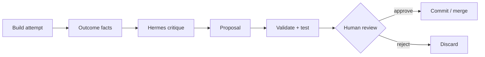

# ADR-0018: Build Kit Evolution Loop with Hermes

## Status

**Proposed**

This ADR describes a **future, controlled improvement loop** only. It does **not** authorize Hermes to edit Build Kit recipes in production, does **not** authorize autonomous commits, and does **not** require any implementation in this document.

Related:

- [ADR-0016: Generative Build Kit Registry v2](0016-generative-build-kit-registry-v2.md)
- [ADR-0017: Opt-in Build Registry v2 scaffold wiring](0017-build-registry-v2-opt-in-scaffold-wiring.md)

---

## Context

Build Kits in HAM are **structured, versioned generative playbooks** — YAML and JSON metadata that guide custom code generation. They are not starter templates or checked-in game source.

Build Registry v2 has reached a machine-checkable baseline:

| Asset | State |
|-------|--------|
| Game Pack pilot | `docs/build-kit-registry-v2/game-pack/` — 33 indexed modules, 2 app types (`game.idle-incremental`, `game.trivia-timer`) |
| Loader / composer / render | `src/ham/build_registry/` |
| Validation | `scripts/validate_game_pack_registry.py`, `tests/test_build_registry.py` |
| Authoring guide | [Build Kit Authoring Guide](../build-kit-registry-v2/AUTHORING_GUIDE.md) |
| Scaffold wiring | Opt-in only per ADR-0017; idle/incremental routing behind `HAM_BUILD_REGISTRY_V2_ENABLED`; default remains v1 |

Hermes (supervisory core in `src/hermes_feedback.py`) already embodies a **critique and learning** concept: structured review over evidence-shaped outcomes. HAM can draw a useful parallel:

- **Hermes skills** — procedural memory for *how to perform tasks*
- **Build Kit recipes** — procedural memory for *how to build app types*

That parallel suggests Hermes could **help critique and propose** recipe improvements over time. It does **not** justify self-mutation of production recipes.

Build Kits must **not** be auto-edited in production. Any evolution loop must be:

- **Reviewable** — normal git diff and ADR/authored-guide compliance
- **Testable** — registry validation and pytest gates
- **Human-approved** — merge only after maintainer review

**Grounded claim today:** Hermes may eventually help critique build outcomes and draft improvement proposals. **Not claimed:** Hermes currently rewrites Build Kit YAML, opens PRs autonomously, or mutates recipes at runtime.

---

## Decision

HAM will treat Build Kits as **structured procedural build knowledge** that may improve over time through a **controlled evolution loop**.

The loop:

```txt
Build attempt
  → collect outcome facts
  → Hermes critique
  → proposed recipe change
  → registry validation / tests
  → human review
  → normal commit / merge
```

**No direct production mutation.** Recipe files change only through the same reviewed repository workflow as any other docs/schema change.

---

## Non-goals

This ADR does **not** authorize or require:

- Automatic mutation of production Build Kit YAML
- Autonomous commits or auto-merge
- Live recipe editing by runtime agents or chat paths
- Telemetry implementation
- Hermes integration implementation
- A new Game Pack recipe
- Routing changes (see ADR-0017; routing remains a separate approval)
- Validator or recovery **execution** changes (validators/recovery stay conceptual unless separately wired)
- User-facing UI for “recipe evolution”
- A new service, database, or background agent fleet

---

## Definitions

| Term | Meaning |
|------|---------|
| **Build Kit recipe** | An app type module (e.g. `game.idle-incremental`) plus its composed mechanics, contracts, validators, recovery, progress, and learning modules in a registry pack. |
| **Build attempt** | One Lane A build run using a recipe (scaffold + optional preview/validation signals), v1 or opt-in v2. |
| **Build outcome facts** | A bounded, redaction-safe summary of what happened (success/failure, recipe id, module ids, fallback reason, etc.) — not raw prompts or secrets by default. |
| **Hermes critique** | Supervisory review of outcome facts: plain-language assessment of whether the recipe guidance failed the build or operator expectations. |
| **Recipe improvement proposal** | A suggested diff or checklist against YAML/docs — guidance tightening, new validator module, recovery link, etc. |
| **Human approval gate** | Required maintainer review and merge; no recipe lands without passing validation commands and explicit human accept. |

---

## Proposed minimal loop

Future minimal loop (no new infrastructure required to adopt this ADR):

1. **HAM runs a build** using a recipe (v1 kit context or opt-in v2 playbook context).
2. **HAM records basic outcome facts**, for example:
   - `app_type_id` / kit id
   - composed module ids (when v2)
   - scaffold success or failure (`LLMScaffoldError` code if any)
   - validation result (conceptual validator id + pass/fail when harness exists)
   - preview result (boot OK / console errors — when available)
   - v2 `fallback_reason`, if any
   - user requested follow-up or edit (when known from chat/workflow)
3. **Hermes reviews** those facts (batch or on-demand — not continuous auto-loop).
4. **Hermes produces** a plain-language critique and an **optional** patch proposal (markdown or diff suggestion — not applied automatically).
5. **Existing validation commands run** on any proposed YAML change.
6. **Human reviews** and merges or rejects via normal git/PR workflow.



---

## What Hermes may suggest

Examples of in-scope suggestions:

- Tighten mechanic `guidance` bullets (clearer timer cleanup, double-submit guards)
- Add a **conceptual** validator module and link a recovery playbook
- Add or refine a recovery playbook `steps[]` for a known failure mode
- Clarify `acceptance_criteria` or `out_of_scope` on an app type
- Reduce prompt bloat in composed render (trim redundant guidance)
- Improve component contract `accessibility_notes` or `expected_props`
- Propose a **future** optional mechanic as a separate follow-up recipe expansion (not bundled into an unrelated PR)

Suggestions should reference [AUTHORING_GUIDE.md](../build-kit-registry-v2/AUTHORING_GUIDE.md) conventions.

---

## What Hermes must not do

Hermes must **not**:

- Edit production recipe files directly without human review
- Bypass `validate_registry_pack`, pytest, or CI
- Add or change prompt routing (`registry_v2_app_type`, `intent.py`) without explicit routing approval
- Add templates, starter source files, or clone baselines
- Remove or weaken `safety_constraints` without extra scrutiny and explicit approval
- Change default runtime behavior (e.g. enable v2 by default)
- Mark `runner: conceptual` validators as executable without a separate implementation ADR/task
- Open or merge PRs autonomously

---

## Minimum evidence before proposing a change

A recipe improvement proposal should cite **at least one** of:

- Repeated build failure pattern (same error code or recovery invocation)
- Validation failure (existing or future harness)
- User correction / follow-up edit pattern (same topic twice)
- Prompt or render budget issue (render &gt; 12k or critical context truncated)
- Missing or broken module reference discovered in practice
- Known recovery gap (failure signal with no linked playbook)
- Maintainer observation from manual smoke or review

No large analytics platform is required for Phase B–D. Structured issue/PR comments and markdown critique reports are sufficient.

---

## Validation gates

Any proposed recipe change must pass:

```bash
python3 scripts/validate_game_pack_registry.py \
  --pack-root docs/build-kit-registry-v2/game-pack \
  --app-type <affected-app-type> \
  --check
```

```bash
pytest tests/test_build_registry.py -q
```

Plus any recipe-specific tests that exist for the affected app type.

Additional gates:

- No orphan YAML (every file indexed in `registry-pack.yaml`)
- All cross-references resolve; no dependency cycles
- Rendered playbook context ≤ 12,000 characters (default budget)
- No templates or starter source files added
- Existing pilot recipes (`game.idle-incremental`, `game.trivia-timer`) still validate after pack-wide edits

---

## Review and approval policy

- **Human review required** for all Build Kit recipe and registry-pack changes.
- **Routing changes are separate** — follow ADR-0017 and [AUTHORING_GUIDE § Routing policy](../build-kit-registry-v2/AUTHORING_GUIDE.md#10-routing-policy); never bundled silently with “evolution” proposals.
- **Safety constraint removals** require extra scrutiny and explicit justification in the PR body.
- **CI** remains the enforcement mechanism as steps graduate from warning-only to blocking (see open questions).
- **Commit history** is the audit trail; there is no shadow recipe store.

---

## Relationship to Hermes skills

| | Hermes skills | HAM Build Kits |
|---|---------------|----------------|
| **Role** | Procedural memory for doing tasks | Procedural memory for building app types |
| **Storage** | Vendored / installed skill bundles | Registry YAML under `docs/` (pilot) |
| **Evolution** | Skill catalog updates via reviewed merges | Same — recipe YAML via reviewed merges |
| **Runtime** | Hermes runtime skill catalog (distinct from operator Cursor skills) | Composed playbook context at scaffold time (opt-in v2) |

Hermes can help improve Build Kits the way skill evolution improves task procedures: **critique → proposal → validate → human merge**. HAM does not treat recipes as a live mutable cache inside Hermes or the API.

---

## Rollout phases

| Phase | Scope | Autonomous mutation |
|-------|--------|---------------------|
| **A — This ADR** | Design agreement only | None |
| **B — Outcome summary format** | Docs-only schema for build outcome facts | None |
| **C — Manual Hermes critique** | Operator-triggered critique prompt for one build run | None |
| **D — Patch proposal** | Hermes-generated suggested diff; not auto-applied | None |
| **E — PR assistant (optional)** | Helper drafts PR description/checklist after gates pass | None — human still merges |

No background agents, no autonomous mutation, no production recipe hot-reload.

---

## Open questions

1. What **minimal outcome facts** should Phase B standardize first (fields, redaction, storage location)?
2. Should critiques live as **markdown reports**, issue comments, or PR comments?
3. When should CI **block** on registry validation vs remain warning-only?
4. Should Hermes critique recipes only after **repeated failures**, or also after single high-severity incidents?
5. How do we prevent **prompt bloat** from accumulated Hermes suggestions (render budget regressions)?
6. Should outcome facts correlate with `learning.*` hook event shapes, or stay separate until telemetry is explicitly scoped?

---

## References

- [ADR-0016: Generative Build Kit Registry v2](0016-generative-build-kit-registry-v2.md)
- [ADR-0017: Opt-in Build Registry v2 scaffold wiring](0017-build-registry-v2-opt-in-scaffold-wiring.md)
- [Build Kit Authoring Guide](../build-kit-registry-v2/AUTHORING_GUIDE.md)
- [Game Pack pilot](../build-kit-registry-v2/game-pack/README.md)
- Registry package: `src/ham/build_registry/`
- Validation script: `scripts/validate_game_pack_registry.py`
- Hermes supervisory core: `src/hermes_feedback.py`
- Scaffold opt-in resolver: `src/ham/build_registry/scaffold_context.py`
