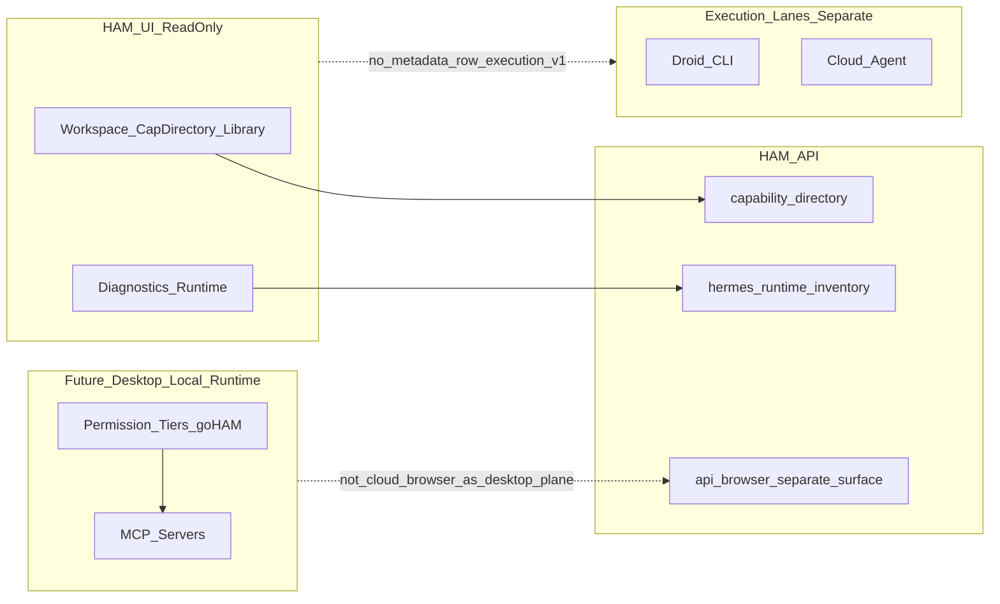

# HAM Computer Control Pack — v1 Specification

**Status:** Phase 0 — design / spec only. No implementation commitment.  
**Version:** 1.0-spec  
**Last updated:** 2026-04-26  

## Document purpose

Define a **HAM-native Computer Control Pack v1** that maps external research on agentic computer control (MCP-first integration, browser automation, orchestration layers, credential safety, autonomy tiers, default-deny policy, audit, kill switches) onto **HAM’s existing surfaces** and a **phased, local-first** product path.

This document is **not** an execution contract. It does **not** prescribe new tools, MCP installs, config mutations, or execution pathways in the HAM API or workspace capability surfaces.

**Desktop Local Control v1** (product path) is specified in [`docs/desktop/local_control_v1.md`](../desktop/local_control_v1.md). It is **not** implemented by **`/api/browser` on Cloud Run** as the desktop control plane; that API remains a separate, server-side surface. The legacy **War Room / in-app browser UI** is **removed** and **must not** be revived as the computer-control UX.

**Research input:** [`computercontrolresearch.md`](../../computercontrolresearch.md) (repo root).  
**Sibling spec (tone and registry model):** [`capability_bundle_directory_v1.md`](capability_bundle_directory_v1.md).

---

## Architecture alignment (non-negotiables)

Computer Control in HAM is a **local runtime / tool capability layer**: it describes how **local** observation and (in later phases) **bounded** action could be exposed **under explicit operator policy**, with evidence and emergency stop — **not** how chat or workspace metadata surfaces “run” arbitrary third-party code.

| Rule | Implication for Computer Control Pack |
|------|----------------------------------------|
| **Local capability layer** | Policy, tiers, and future MCP/tool attachments are **grounded on the operator machine**; cloud-hosted control of the local computer is **out of scope** for v1 and flagged as non-goal. |
| **Not a Cursor / Droid harness** | Factory Droid CLI, Cursor Cloud Agent, and legacy War Room uplink (removed **Batch 2A**) remain **separate execution lanes** from Computer Control. The pack **must not** redefine them as the universal host for desktop automation. |
| **Not a ControlPlaneRun participant (v1)** | [`ControlPlaneRun`](../../docs/CONTROL_PLANE_RUN.md) stays a **read-side** launch/audit substrate for Cursor/Droid-style control plane; Computer Control **does not** join that schema or storage in v1. |
| **Not cloud-first** | Design assumes **local-only** runtime boundary for high-trust modes; any remote broker is **documentation-only** future work, not v1. |
| **Not arbitrary workspace execution** | Workspace **Capability Directory** and **My Library** remain **read-only discovery** for Phase 1; directory rows are **data**, not behavior ([`capability_bundle_directory_v1.md`](capability_bundle_directory_v1.md)). No run/execute CTAs from metadata rows for computer control. |
| **No credential exfiltration surface (v1)** | No secrets, raw config, env values, tokens, auth headers, or full local paths in operator-facing copy or APIs introduced by this pack in early phases. Phantom Token (see §3) is a **future** architectural pattern, not a shipped feature in v1. |
| **No mock data as truth** | Demo or placeholder UI data must **never** back diagnostics or permission state for Computer Control. |
| **Hermes = supervision / runtime inventory / skills** | Hermes CLI, vendored skills catalog, live overlay, and install preview/apply are **distinct** concerns; see §2. |

### Layer diagram (conceptual)



**Kill switch (research alignment):** Emergency stop for high-autonomy modes must ultimately live in a **control plane outside the agent reasoning loop** (e.g. process supervisor or shell main process), revoking session capability and severing tool connections — not only `SIGINT` on a single child process.

---

## 1. Current HAM capability inventory (repo-grounded)

*Inspection basis: paths below; behavior summarized from code and docs, not assumed.*

### 1.1 Browser control (server-side Playwright)

| Aspect | Ground truth |
|--------|----------------|
| **API** | `GET/POST` under prefix `/api/browser` — [`src/api/browser_runtime.py`](../../src/api/browser_runtime.py). |
| **Implementation** | [`src/ham/browser_runtime/`](../../src/ham/browser_runtime/) (session manager, I/O, policy errors). |
| **Gate** | Router uses Clerk + email gate (`get_ham_clerk_actor`) for dashboard-class access. |
| **Semantics** | Create session, navigate, click (selector / XY), type, scroll, key, screenshot/stream bodies — **existing** automation surface on the **API host**, not the **Desktop Local Control v1** product plane ([`docs/desktop/local_control_v1.md`](../desktop/local_control_v1.md)). |

**Directory:** Phase 1 includes the read-only bundle `computer-control-local-operator` plus atomic documentation ids; **`/api/browser` does not define shipped desktop-local policy** — see Local Control v1 spec.

### 1.2 Hermes runtime inventory

| Aspect | Ground truth |
|--------|----------------|
| **Module** | [`src/ham/hermes_runtime_inventory.py`](../../src/ham/hermes_runtime_inventory.py). |
| **API** | `GET /api/hermes-runtime/inventory` — [`src/api/hermes_runtime_inventory.py`](../../src/api/hermes_runtime_inventory.py). |
| **Degradation** | `HAM_HERMES_SKILLS_MODE=remote_only` disables local CLI inventory (honest empty/partial). |

**Fit for Computer Control:** Inventory is **read-only truth** for “what Hermes thinks is installed” — useful for Diagnostics and future “local prerequisites” stories; it does **not** grant desktop control.

### 1.3 Hermes skills: catalog, live overlay, install (distinction)

| Concern | Ground truth |
|---------|----------------|
| **Vendored catalog** | [`src/ham/data/hermes_skills_catalog.json`](../../src/ham/data/hermes_skills_catalog.json), loader [`src/ham/hermes_skills_catalog.py`](../../src/ham/hermes_skills_catalog.py). |
| **Read APIs** | Catalog + installed overlay via [`src/api/hermes_skills.py`](../../src/api/hermes_skills.py) (e.g. `GET /api/hermes-skills/catalog`, `GET /api/hermes-skills/installed`). |
| **Live overlay** | [`src/ham/hermes_skills_live.py`](../../src/ham/hermes_skills_live.py) — join of allowlisted CLI output + catalog. |
| **Install** | Preview/apply: token-gated (`HAM_SKILLS_WRITE_TOKEN`), audit — **mutating**, separate from directory read paths. |

**Spec rule:** Computer Control Pack **documents** candidate Hermes skill / MCP alignment; it does **not** expand install apply scope or merge MCP config in v1.

### 1.4 Capability Directory, Workspace, My Library

| Concern | Ground truth |
|---------|----------------|
| **Directory data** | [`src/ham/data/capability_directory_v1.json`](../../src/ham/data/capability_directory_v1.json). |
| **Server** | [`src/ham/capability_directory.py`](../../src/ham/capability_directory.py), [`src/api/capability_directory.py`](../../src/api/capability_directory.py). |
| **Library** | [`src/ham/capability_library/`](../../src/ham/capability_library/), API [`src/api/capability_library.py`](../../src/api/capability_library.py). |
| **Workspace UI** | Bundles surface as **read-only metadata** on workspace routes (e.g. skills / library flows); rows are **data**, not execution. Legacy `/shop` routes, if present, are **redirect-only** — do not treat them as a control execution surface. |

**Semantics:** Aligns with Directory v1 “registry records = data, not behavior.” **Desktop Local Control v1** is **not** [`/api/browser`](../../src/api/browser_runtime.py) on Cloud Run as the product control plane.

### 1.5 Desktop shell (Milestone 1)

| Aspect | Ground truth |
|--------|----------------|
| **Docs** | [`desktop/README.md`](../../desktop/README.md). |
| **Model** | Thin Electron shell; renderer = Vite app; FastAPI separate. |
| **Hermes** | Curated bundle + allowlisted CLI presets (fixed argv, timeout, capped output) — **not** free-form terminal control. |
| **Managed browser (4B + Phase 1A)** | Where policy allows: **main-process** embedded MVP (**Linux-only**) and managed Chromium **+ localhost CDP** (**Linux dev shell + Windows** packaged builds — see `desktop/local_control_status.cjs`). Settings → Display → Local Control supports **desktop IPC**: start, navigate, **reload**, screenshot, stop; Capability Directory / Shop stay non-executable (`apply_available` false). **Linux AppImage `.deb` installers are not shipped** from this repo. |
| **Future** | See [`docs/desktop/local_control_v1.md`](../desktop/local_control_v1.md) for **Local Control v1** (Phase 2+); Computer Control **aligns** to that seam, not to bypassing sandbox/security review. |

### 1.6 HAM CLI: `doctor` and `readiness`

| Command | Ground truth |
|---------|----------------|
| **doctor** | [`src/ham_cli/commands/doctor.py`](../../src/ham_cli/commands/doctor.py) — Python version, imports, desktop/node/npm hints, optional `/api/status` reachability. |
| **readiness** | [`src/ham_cli/commands/readiness.py`](../../src/ham_cli/commands/readiness.py) — richer local checklist, git cleanliness, pack scripts, etc. |

**Phase 1 fit:** Add **non-mutating** checks (e.g. “Playwright/browser runtime deps present”, “optional MCP binary on PATH”) as **hints only** — no auto-install.

### 1.7 Agent Builder (later coupling)

| Aspect | Ground truth |
|--------|----------------|
| **Models** | [`src/ham/agent_profiles.py`](../../src/ham/agent_profiles.py). |
| **UI** | [`frontend/src/pages/AgentBuilder.tsx`](../../frontend/src/pages/AgentBuilder.tsx). |
| **Writes** | Settings subtree via token-gated project settings — **out of scope** for Computer Control v1 spec implementation. |

**Positioning:** Future: agent profiles may **reference** bundle ids or policy tiers as **metadata**; no execution from profile row.

### 1.8 Runs / Activity (future evidence layer)

| Aspect | Ground truth |
|--------|----------------|
| **Runs** | [`src/persistence/run_store.py`](../../src/persistence/run_store.py), `.ham/runs/*.json`. |
| **Activity UI** | Activity-related pages under `frontend/src/pages/`. |

**Positioning:** Structured **action/event audit** for computer control (Phase 4+) should align with existing run/evidence patterns — **schema TBD**; v1 does not define new run kinds.

### 1.9 Browser / Browser Operator (future surface)

| Aspect | Ground truth |
|--------|----------------|
| **API** | [`src/api/browser_runtime.py`](../../src/api/browser_runtime.py), [`src/api/browser_operator.py`](../../src/api/browser_operator.py) — Playwright sessions + proposal/approval path (unchanged). |
| **Dashboard** | Hermes Workspace chat at **`/workspace/chat`**; legacy War Room / in-app browser operator UI removed (**Batch 2A**). |

**Positioning:** Any **server-hosted** browser automation remains **approval-gated** under `/api/browser`; **Desktop Local Control v1** still does **not** use that route as the **desktop product control plane** ([`docs/desktop/local_control_v1.md`](../desktop/local_control_v1.md)) — **UI plan only** in this spec.

### 1.10 Gaps (summary)

- Read-only Capability Directory bundle `computer-control-local-operator` documents the pack; **no** executing browser automation from directory rows.
- No first-class MCP server registry in HAM beyond documentation placeholders (see Directory v1).
- No local MCP process supervisor in HAM product today — **by design** until Phase 3+.
- Droid/Cursor lanes must remain **architecturally separate** from Computer Control Pack v1.

---

## 2. External technology mapping

For each item: **fit for HAM**, **risk**, **local-only**, **v1 suitability**, **do-not-touch-yet**.

### 2.1 Model Context Protocol (MCP) — integration standard

| Dimension | Assessment |
|-----------|------------|
| **Fit** | Strong: decouples agent client from tool server; matches HAM’s “data in directory, enforcement on execution plane” split. |
| **Risk** | Medium: misconfigured MCP servers can expose broad host access; marketplace/unvetted servers are hazardous (research: plugin hub supply-chain). |
| **Local-only** | Yes — v1 assumes **local** MCP processes for any future attachment. |
| **v1 suitability** | **Document only** — no new MCP wiring in Phase 0–1. |
| **Do-not-touch-yet** | Auto-install of community MCP from product CTAs; remote MCP as default. |

### 2.2 Desktop Commander MCP

| Dimension | Assessment |
|-----------|------------|
| **Fit** | Strong candidate for **terminal / files / process** tooling **outside** HAM FastAPI — if/when a local supervisor exists. |
| **Risk** | High if unsandboxed: broad host powers (research: “broad host access if not sandboxed”). |
| **Local-only** | Excellent fit for local operator machine. |
| **v1 suitability** | **Candidate only** in bundle manifest; no install. |
| **Do-not-touch-yet** | Connecting Desktop Commander to cloud chat without local boundary and kill switch. |

### 2.3 Browser-Use / Playwright-style browser automation

| Dimension | Assessment |
|-----------|------------|
| **Fit** | HAM already has **Playwright-shaped** server browser I/O under `/api/browser`; research library “Browser-Use” is a **pattern reference**, not a required dependency. |
| **Risk** | High if unrestricted: prompt injection, session hijack, exfil (research). |
| **Local-only** | Browser sessions should stay **operator-local** or explicitly bounded. |
| **v1 suitability** | **Phase 2**: reuse **existing** API with **approval-only** UX — not new automation stack in v1. |
| **Do-not-touch-yet** | Unrestricted Playwright with live profile sync and no egress policy. |

### 2.4 Hermes tools / MCP / plugins

| Dimension | Assessment |
|-----------|------------|
| **Fit** | Hermes is the **orchestration / runtime** adjacent to HAM; native MCP support in Hermes (research) aligns with “tool coordination layer.” |
| **Risk** | Config complexity and accidental over-permissioning. |
| **Local-only** | Hermes can run local MCP; HAM surfaces inventory/skills **read-only** today. |
| **v1 suitability** | **Documentation + directory** only; tie-ins via `candidate_hermes_skills_toolsets` in bundle. |
| **Do-not-touch-yet** | Mutating Hermes `config.yaml` or MCP lists from one-click product flows. |

### 2.5 OpenHands / sandboxed execution model

| Dimension | Assessment |
|-----------|------------|
| **Fit** | Strong **reference** for **sandboxed** coding/workspace tasks (Docker/K8s, RBAC). |
| **Risk** | Infra overhead; not a drop-in for all HAM users. |
| **Local-only** | Can be local Docker/VPC; aligns with “isolation before autonomy.” |
| **v1 suitability** | **Pattern only** — no OpenHands bundle execution in v1. |
| **Do-not-touch-yet** | Claiming parity or shipping OpenHands as mandatory dependency without product decision. |

### 2.6 Filesystem MCP / Playwright MCP / Terminal MCP (generic options)

| Dimension | Assessment |
|-----------|------------|
| **Fit** | Official filesystem MCP: **scoped paths**; Playwright MCP: browser; terminal MCP: shell — map to risk tiers §4. |
| **Risk** | Filesystem: path escape; Terminal: RCE; Playwright: web exfil. |
| **Local-only** | All are appropriate **local** servers when configured. |
| **v1 suitability** | **Named candidates** in manifest only. |
| **Do-not-touch-yet** | Bundling unsigned community variants into “recommended” without review. |

### 2.7 Phantom Token Pattern (credentials)

| Dimension | Assessment |
|-----------|------------|
| **Fit** | Critical **future** pattern: agent holds short-lived **proxy** identity; real secrets live outside agent reach (research §6.2). |
| **Risk** | Implementing poorly gives false confidence. |
| **Local-only** | Proxy on localhost boundary matches HAM local-first story. |
| **v1 suitability** | **Explicitly out of scope** — document as **future** hardening; v1 has **no credential handling** (see §10). |
| **Do-not-touch-yet** | Shipping “phantom” tokens without crypto review and threat model. |

---

## 3. Permission tier matrix

Rows: autonomy tiers. Columns: capability / policy. Cells: **Y** = allowed in principle (subject to Phase), **N** = not allowed in v1, **Later** = phased.

| Tier | Screen/browser observe | Browser click/type | File read | File write | Terminal | App/OS control | Destructive / external | Confirmation | Audit | Local-only | Allowed in v1? |
|------|------------------------|--------------------|-----------|------------|----------|----------------|------------------------|--------------|-------|------------|----------------|
| **observe_only** | Y (passive) | N | N (or scoped read via existing repo context only, not arbitrary FS) | N | N | N | N | Low | Y | Y | **Partial** — inventory/catalog only; no new observe surface |
| **assistive** | Y | N | N | N | N | N | N | Medium (plan review) | Y | Y | **N** — UX pattern only in spec |
| **operator_approved** | Y | Later | Later | Later | Later | N | N | High | Y | Y | **N** in v1; **Phase 2** targets browser via existing API + approvals |
| **bounded_autopilot** | Y | Later | Later | Later | Later | N | N | Medium + caps | Y | Y | **N** until Phase 4 |
| **goham_session** | Y | Later | Later | Later | Later | Later | **Blocked by default** | High + phrase | Y | **Y (mandatory)** | **N** until Phase 5 |

**Note:** v1 **Phase 0–1** = documentation + directory + CLI hints only — effectively **observe_only** at the product level.

---

## 4. Risk tier policy

| Tier | Description | Allowed in v1? | Blocked examples (non-exhaustive) | Confirmation | Logging / evidence | Rollback |
|------|-------------|----------------|-------------------------------------|--------------|-------------------|----------|
| **0** | Observe | **Yes** (existing diagnostics, inventory, catalog) | N/A | N/A | Access logs optional | N/A |
| **1** | Browser navigation / click / type | **No** new product path; **Phase 2** with approval | Auto-login, credential fields, arbitrary downloads | Per-action or batch approval | Session id, URL, action type, timestamps | Close session; revert navigation where possible |
| **2** | File read | **No** in pack v1 | Reading SSH keys, wallet files, entire `$HOME` | Operator scope picker | Path **category** (not full raw path in remote logs) | N/A |
| **3** | File write | **No** | Overwrite system configs, `.ham/settings.json`, secrets | Strong | Diff/snapshot where feasible | Git restore / snapshot restore |
| **4** | Terminal command | **No** | `curl \| bash`, `rm -rf /`, package installs | Strong | Command allowlist hash, exit code, capped stdout | Limited — kill processes |
| **5** | App / OS control | **No** | Kill system services, install drivers | Very strong | Full audit | OS-dependent |
| **6** | Destructive / external | **No** in v1–4; **default-deny** in goHAM | Payments, email send, public posts, crypto txs | Human + phrase | Immutable audit event | Financial/legal: often **non-rollback** |

---

## 5. goHAM session design (Phase 5 target)

**Definition:** A **temporary, explicit, local high-trust session** that grants **broad** computer-control authority within a **visible, bounded scope**, with mandatory safety rails.

| Element | Requirement |
|---------|-------------|
| **Activation** | Dedicated **activation screen**; not a hidden toggle; cannot be default-on. |
| **Typed confirmation phrase** | Operator types a **high-friction phrase** (not a single click). |
| **Duration** | Hard **time limit**; session **auto-expires**; optional idle timeout. |
| **Scope** | Explicit **scope selector** (e.g. repo root, allowed URL patterns, allowed path prefixes — **design detail TBD**); scope **shown** for entire session. |
| **Emergency stop** | **Prominent** control; invokes **control-plane** stop (revoke capability, sever MCP/browser sessions). |
| **Blocked action classes** | **Default-deny** list: credentials, payments, destructive delete, security config mutation, arbitrary network exfil tools. |
| **Session log** | **Structured** timeline of actions/events for review; export-friendly shape **TBD** (align with Runs/Activity). |
| **Auto-demotion** | On **threshold breach** (rate limits, repeated denials, policy violation, anomaly heuristics): demote to **operator_approved** or **full stop**. |
| **Local-only boundary** | Session **valid only** on local runtime; no “remote goHAM” in v1 design. |
| **Defaults** | **No credentials**, **no payments**, **no destructive delete** without explicit **separate** human gate (still discouraged). |

---

## 6. Proposed first capability bundle manifest

**id:** `computer-control-local-operator`

The JSON below is **historical / illustrative** only. The **canonical** bundle record is [`src/ham/data/capability_directory_v1.json`](../../src/ham/data/capability_directory_v1.json) (`computer-control-local-operator`), aligned with [`docs/desktop/local_control_v1.md`](../desktop/local_control_v1.md).

```json
{
  "id": "computer-control-local-operator",
  "schema_version": "capability.directory.v1",
  "kind": "bundle",
  "display_name": "Computer Control — Local Operator (Pack v1)",
  "summary": "Read-only documentation bundle for local computer-control prerequisites, policy tiers, and future Browser Operator / MCP alignment. No execution from this row.",
  "description": "Maps research-backed patterns (MCP-first, Playwright browser automation, sandbox references, Phantom Token as future credential story) to HAM surfaces. Execution lanes (Droid, Cursor) and ControlPlaneRun are out of scope for this pack in v1.",
  "trust_tier": "first_party",
  "provenance": {
    "source_kind": "ham_repo",
    "registry_revision": "TBD",
    "note": "Add on Phase 1; revision bumps with registry."
  },
  "version": "1.0.0",
  "required_backends": [
    "ham_api_read_only",
    "local_operator_workstation"
  ],
  "capabilities": [
    "api.hermes_runtime.inventory",
    "api.hermes_skills.catalog",
    "api.hermes_skills.installed_overlay",
    "api.capability_directory.read"
  ],
  "skills": [],
  "tools_policy": {
    "mode": "documentation_only_phase_1",
    "notes": [
      "Phase 2 may attach policy.browser_operator_approval_only to existing /api/browser usage.",
      "No arbitrary shell from capability metadata rows; Droid/Cursor remain separate harnesses."
    ]
  },
  "mcp_policy": {
    "mode": "candidates_declared_only",
    "notes": [
      "Candidate MCP: Desktop Commander (terminal/files/process).",
      "Candidate MCP: official filesystem (scoped roots).",
      "Candidate MCP: Playwright or browser tool server — align with existing HAM browser_runtime.",
      "No MCP install or config mutation from HAM in v1."
    ]
  },
  "model_policy": {
    "mode": "not_applicable_phase_1",
    "notes": ["Pack v1 Phase 1 is non-LLM registry documentation."]
  },
  "memory_policy": {
    "mode": "not_applicable",
    "notes": []
  },
  "surfaces": [
    { "route": "/workspace/skills", "label": "Workspace skills (metadata)" },
    { "route": "/workspace", "label": "Hermes Hub / Diagnostics" },
    { "route": "/workspace/chat", "label": "Workspace chat (related)" }
  ],
  "mutability": "read_only",
  "preview_available": false,
  "apply_available": false,
  "risks": [
    "Operators confusing documentation with installed local MCP.",
    "Assuming Hermes inventory implies browser or desktop control.",
    "Using frontend mock extension data as runtime truth."
  ],
  "evidence_expectations": [
    "Phase 1: operator can find bundle in Workspace capability metadata and see CLI readiness hints.",
    "Phase 2+: browser actions produce auditable events tied to session and approval."
  ],
  "tags": ["computer_control", "local_only", "mcp_candidates", "browser_operator_future"],
  "candidate_mcp_dependencies": [
    "desktop-commander (npx/Docker — org to pin version)",
    "@modelcontextprotocol/server-filesystem (scoped)",
    "playwright or browser automation MCP (TBD alignment with ham browser_runtime)"
  ],
  "candidate_hermes_skills_toolsets": [
    "Hermes catalog ids TBD after org review — document only"
  ],
  "permissions_matrix_ref": "docs/capabilities/computer_control_pack_v1.md §3",
  "risk_tier_ref": "docs/capabilities/computer_control_pack_v1.md §4",
  "goham_future_extension_notes": "Phase 5: session object with duration, scope, phrase confirmation, emergency stop, default-deny classes, auto-demotion; Phantom Token for secrets if product adopts delegated auth.",
  "unavailable_states": [
    "HAM_HERMES_SKILLS_MODE=remote_only (inventory partial)",
    "Clerk/session gate absent when API enforces actor",
    "Packaged desktop without local API reachability"
  ],
  "diagnostics_checks": [
    "ham doctor / ham readiness — extend with optional browser/MCP hints",
    "GET /api/hermes-runtime/inventory",
    "GET /api/capability-directory/capabilities (exact path per server router)"
  ]
}
```

---

## 7. Where it appears in HAM

| Surface | Phase 0–1 intent |
|---------|------------------|
| **Workspace / Capability Directory** | Bundle row as **read-only** metadata (skills / library flows); no Run CTA. |
| **My Library** | Optional save of directory ref (`hermes:` / `capdir:` style) — **same as other bundles**; no execution. |
| **Diagnostics → Hermes / Runtime** | Cross-link from inventory/skills pages; explain **local vs remote** degradation. |
| **Desktop shell** | Future: settings / diagnostics alignment with Phase 3 observe mode; **no new IPC** in v1 spec implementation. |
| **HAM CLI readiness** | `doctor` / `readiness` extended with **hints** for local prerequisites (Phase 1). |
| **Agent Builder** | **Later**: profile metadata may reference pack id; no computer-control execution from profile. |
| **Runs / Activity** | **Later**: structured audit events for Phase 4+; align with `.ham/runs` patterns. |

---

## 8. Implementation phases

| Phase | Scope |
|-------|--------|
| **0** | **Spec only** — this document + review; no code. |
| **1** | Add **Computer Control Pack** to Capability Directory as **read-only** workspace metadata; extend **CLI readiness** checks for local prerequisites **only** (no install, no execution). |
| **2** | **Browser / automation (if any)** — any reuse of [`/api/browser`](../../src/api/browser_runtime.py) stays a **separate API surface**; **Desktop Local Control v1** does **not** treat Cloud Run `/api/browser` as the desktop product control plane ([`docs/desktop/local_control_v1.md`](../desktop/local_control_v1.md)). |
| **3** | **Desktop-local** observe/control milestones per [`local_control_v1.md`](../desktop/local_control_v1.md) — prioritize **Windows** packaged app + **Linux** dev shells (**not** “Linux installers”); **not** War Room revival. |
| **4** | **Bounded autopilot** within declared caps + **evidence logs** (Runs/Activity alignment). |
| **5** | **goHAM session mode** — full local high-trust session object per §5 + kill switch + auto-demotion. |

---

## 9. Exact Phase 1 file plan (likely edits — not performed in Phase 0)

When Phase 1 is approved, expect touches **only** along these paths (subject to review):

| File / area | Change class |
|-------------|--------------|
| [`docs/capabilities/computer_control_pack_v1.md`](computer_control_pack_v1.md) | Revision bumps, typos, cross-links after feedback. |
| [`src/ham/data/capability_directory_v1.json`](../../src/ham/data/capability_directory_v1.json) | Add bundle `computer-control-local-operator` (+ optional atomic stubs if needed for `capabilities` list consistency). |
| [`src/ham/capability_directory.py`](../../src/ham/capability_directory.py) | Only if validation or indexing rules need extending for new ids. |
| [`src/api/capability_directory.py`](../../src/api/capability_directory.py) | Only if API surface requires new filter metadata (prefer none). |
| Workspace / capability UI | Data-driven labels from JSON only; no execution hooks. |
| [`src/ham_cli/commands/doctor.py`](../../src/ham_cli/commands/doctor.py) | Optional: print hints when browser/MCP prerequisites missing. |
| [`src/ham_cli/commands/readiness.py`](../../src/ham_cli/commands/readiness.py) | Optional: table rows for computer-control readiness. |
| [`docs/capabilities/capability_bundle_directory_v1.md`](capability_bundle_directory_v1.md) | One-line cross-link to Computer Control Pack. |

**Explicit non-touches for Phase 1:** Hermes `config.yaml`, MCP global config, [`.ham/settings.json`](../../src/ham/settings_write.py), Droid registry execution policy, ControlPlaneRun schema.

---

## 10. Non-goals

- **No unattended full-computer autonomy** in v1–4.
- **No credential handling** or Phantom Token implementation in v1.
- **No payments or purchases** driven by computer control.
- **No destructive file actions** as defaults; **no** `rm -rf`, mass delete, or shadow writes from workspace metadata surfaces.
- **No arbitrary shell execution** triggered from capability directory rows or library saves.
- **No War Room / in-app browser operator UI** revival.
- **No positioning `/api/browser` (Cloud Run) as Desktop Local Control v1** — see [`docs/desktop/local_control_v1.md`](../desktop/local_control_v1.md).
- **No cloud-hosted control** of the local computer; **no public remote control endpoint**.
- **No bypassing OS permissions** or elevation stories in v1.
- **No using mock marketplace or extension-grid demo data** as operational truth.
- **No install / apply / run / launch / execute CTAs** for Computer Control in Phase 0–1.

---

## 11. Open questions (human decisions before implementation)

1. **API vs desktop plane:** Clerk-gated `/api/browser` (server) vs **Desktop Local Control v1** (local policy/consent) — how do they stay distinct? See [`docs/desktop/local_control_v1.md`](../desktop/local_control_v1.md).
2. **Kill switch ownership:** Electron **main process** vs separate supervisor vs Hermes-side — who is authoritative?
3. **Audit storage:** New run kind vs extend `.ham/runs` vs append-only local JSONL — privacy and redaction rules?
4. **Scope model:** Single **repo root** vs user-picked **allowlist folders** vs URL allowlists for browser — product default?
5. **Path redaction:** How to log evidence without leaking full paths in cloud-synced UIs?
6. **MCP pinning:** Org policy for **which** Desktop Commander / filesystem server versions are “first-party recommended.”
7. **Hermes coupling:** Does Hermes **own** MCP allowlists for computer control, or HAM desktop shell, or **both** with explicit precedence?
8. **Phase 3 observe:** Screen capture vs window metadata only — privacy/compliance threshold?
9. **goHAM phrase and liability:** Legal/copy review for “high trust” messaging.
10. **Approval UX:** Per-action vs batched plans — target for future desktop-local gates, not War Room revival.

---

## Validation checklist (for reviewers)

- [ ] Spec states local runtime layer and all architecture negations in §0.
- [ ] Inventory cites real paths; gaps explicit.
- [ ] Permission and risk tables present.
- [ ] goHAM section complete.
- [ ] Bundle id `computer-control-local-operator` present.
- [ ] Phases 0–5 and Phase 1 file list present.
- [ ] Non-goals and open questions present.
- [ ] Diagram included.

**Phase 0 completion:** Merge or commit **this document only** after review; no code/config in the same changeset as first landing if policy requires strict separation.
